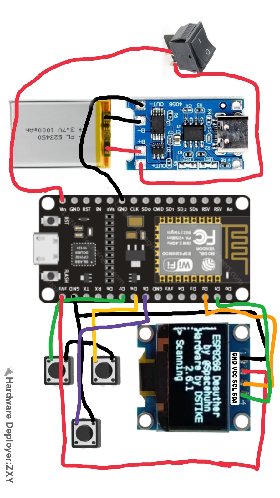

# 🛠️ DIY ESP8266 Wi-Fi Deauther with OLED Display

Wi-Fi Pentesting Tool portabel berbasis NodeMCU ESP8266 Amica dan Layar OLED 0.96". Base software dikembangkan oleh Spacehuhn.

---

## 📋 Komponen yang Dibutuhkan
* **Microcontroller:** NodeMCU Amica ESP8266 (Driver CP2102)
* **Display:** Layar OLED 0.96 Inch SSD1306 (Wajib Varian 4-Pin I2C)
* **Tombol:** 3x Tactile Push Button (Navigasi Menu)
* **Power:** Modul Charger TP4056 Type-C + Baterai Li-Po 3.7V (1000mAh) + Sakelar Rocker

---

## 🔌 Detail Jalur Kabel & Pinout

### 1. Sistem Daya (Power)
* TP4056 **B+** terhubung ke Baterai **(+)**
* TP4056 **B-** terhubung ke Baterai **(-)**
* TP4056 **OUT+** masuk ke Sakelar Rocker, lalu keluar menuju Pin **Vn (Vin)** NodeMCU *(Kabel Merah)*
* TP4056 **OUT-** terhubung langsung ke Pin **GND** NodeMCU *(Kabel Hitam)*

### 2. Layar OLED (4-Pin I2C)
* Pin **VCC** OLED ➡️ Pin **3V3** NodeMCU *(Kabel Merah)*
* Pin **GND** OLED ➡️ Pin **GND** NodeMCU *(Kabel Hitam)*
* Pin **SCL** OLED ➡️ Pin **D2** NodeMCU *(Kabel Oranye)*
* Pin **SDA** OLED ➡️ Pin **D1** NodeMCU *(Kabel Hijau)*

### 3. Tombol Navigasi (Sistem Ground Bersama)
* **Tombol UP:** Kaki Data ke Pin **D6** NodeMCU *(Kabel Hijau)* & Kaki Ground ke **GND**
* **Tombol DOWN:** Kaki Data ke Pin **D7** NodeMCU *(Kabel Kuning)* & Kaki Ground ke **GND**
* **Tombol ENTER:** Kaki Data ke Pin **D5** NodeMCU *(Kabel Ungu)* & Kaki Ground ke **GND**

---

## 📸 Skema Visual Layout

---

## 🛐 Credit
* **Software:** [@Spacehuhn](https://github.com/spacehuhn)
* **🔌 Hardware Deployer:** ZXY
